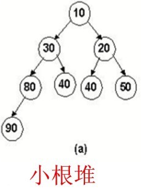

最小堆
---


### 定义

（1）是一颗完全二叉树；

（2）根结点的键值是所有堆结点键值中最小者，且每个结点的值都比其孩子的值小。



数组写成: [10, 30, 20, 80, 40, 40, 50, 90]

### 实现

```javascript
  const arr = [];

  function siftDown(heap, node, i) {
    let index = i;
    const length = heap.length;
    while (index < length) {
      const leftIndex = (index + 1) * 2 - 1;
      const left = heap[leftIndex];
      const rightIndex = leftIndex + 1;
      const right = heap[rightIndex];

      if (left !== undefined && left < node) {
        if (right !== undefined && right < left) {
          heap[index] = right;
          heap[rightIndex] = node;
          index = rightIndex;
        } else {
          heap[index] = left;
          heap[leftIndex] = node;
          index = leftIndex;
        }
      } else if (right !== undefined && right < node) {
        heap[index] = right;
        heap[rightIndex] = node;
        index = rightIndex;
      } else {
        return;
      }
    }
  }

  function siftUp(heap, node, i) {
    let index = i;
    while (true) {
      // 除 2 向上取整
      const parentIndex = (index - 1) >>> 1;
      // 父节点
      const parent = heap[parentIndex];
      if (parent !== undefined && parent > node) {
        heap[parentIndex] = node;
        heap[index] = parent;
        index = parentIndex;
      } else {
        return;
      }
    }
  }
  // 删除
  function pop(heap) {
    const first = heap[0];
    if (first !== undefined) {
      const last = heap.pop();
      if (last !== first) {
        heap[0] = last;
        siftDown(heap, last, 0);
      }
      return first;
    } else {
      return null;
    }
  }


  // 添加
  function push(heap, node) {
    const index = heap.length;
    heap.push(node);
    siftUp(heap, node, index);
  }

  push(arr, 99);
  push(arr, 2);
  push(arr, 3);
  push(arr, 8);
  push(arr, 6);
  push(arr, 1);
  push(arr, 10);
  push(arr, 33);
  push(arr, 61);

  console.log(arr);

  pop(arr);

  console.log(arr);
```

### 复杂度

平均情况下（插入到末尾）插入为O（1），最坏情况下插入为O（log n）。删除为O（log n）。偷看是O（1）
